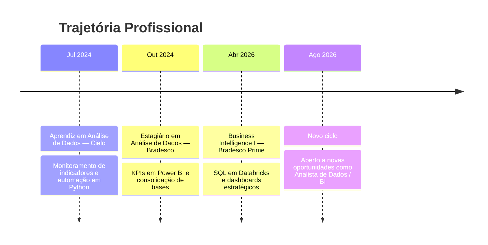

  

 

  

  

 

## 🧭 Sobre mim

<table>
<tr>
<td width="58%" valign="top">

> Analista de Dados com experiência em **SQL, Power BI, DAX, Databricks e ETL**, construindo dashboards executivos, análises exploratórias e cruzamento de bases para dar suporte à decisão estratégica em ambiente corporativo.
>
> Base sólida em engenharia de dados aplicada a negócio, com conhecimento complementar em **desenvolvimento full stack** (React, Node.js, TypeScript, PostgreSQL), voltado à automação de processos e integração de sistemas.

&nbsp;

🎓&nbsp;&nbsp;Estudante de **Engenharia de Software** na FIAP
📍&nbsp;&nbsp;Osasco, SP — Brasil
💼&nbsp;&nbsp;Experiência em BI corporativo no **Bradesco / Bradesco Prime**
🚀&nbsp;&nbsp;Criador do **FYNCOP**, SaaS financeiro com IA
🌱&nbsp;&nbsp;Aprendendo continuamente novas ferramentas de dados, cloud e IA
💬&nbsp;&nbsp;Disponível para novas oportunidades como **Analista de Dados / BI**

</td>
<td width="42%" align="center">

</td>
</tr>
</table>

 

## 🛠️ Stack técnica

<b>DATA & ANALYTICS</b>

  

<b>LINGUAGENS & DESENVOLVIMENTO</b>

  

  

<b>BANCOS DE DADOS & FERRAMENTAS</b>

  

 

## 📈 Trajetória

 

## 🚀 Projeto em destaque

<table>
<tr>
<td align="center" width="100%">

  

<b>FYNCOP</b> — plataforma SaaS de controle financeiro com inteligência artificial, que gera insights automáticos sobre gastos e projeções. Construída do zero com React, Node.js, Express e Supabase.

  

  

🔗 Case studies completos no meu portfólio: <a href="https://pedro-moura.vercel.app"><b>pedro-moura.vercel.app</b></a>

</td>
</tr>
</table>

 

## 📊 GitHub Stats

 

 

 

 

### 📫 Vamos conversar sobre dados, tecnologia e oportunidades?

  

